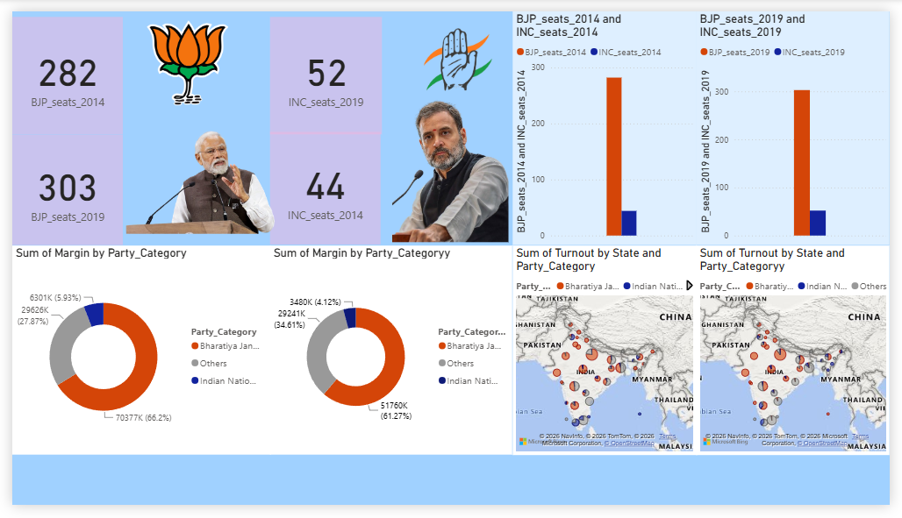

# India Lok Sabha Election Analysis Dashboard

**Tool:** Power BI  
**Dataset:** India Lok Sabha Election Results — 2014 & 2019  
**Type:** Political Data Analysis · Business Intelligence

---

## Overview

A comparative analysis of India's two most recent Lok Sabha general elections — 2014 and 2019. The dashboard visualizes seat counts, victory margins, voter turnout by state, and party-wise performance to tell the complete story of how India voted across two historic elections.

---

## Dashboard

---

## Key Findings

**1. BJP strengthened its majority from 2014 to 2019**  
BJP won 282 seats in 2014 and increased to 303 seats in 2019 — a gain of 21 seats, reinforcing its position as the dominant political force in India across both elections.

**2. INC showed marginal recovery but remained far behind**  
INC won 44 seats in 2014 and improved to 52 seats in 2019 — a gain of 8 seats, but still a fraction of BJP's total, reflecting the continued dominance of the ruling party.

**3. BJP commanded over 60% of the total vote margin**  
The margin analysis shows BJP accounting for approximately 66% of total victory margins across constituencies, indicating not just more seats but larger winning margins on average.

**4. Voter turnout concentrated in specific states**  
The geographic map reveals clear regional patterns in voter turnout — certain states consistently show higher engagement across both election cycles, providing insight into India's political geography.

**5. Party dominance is consistent across both cycles**  
Side-by-side comparison of 2014 and 2019 shows BJP's dominance was not a one-time event but a sustained political trend, while Others (regional parties) maintained a consistent ~28% share.

---

## Dashboard Features

- KPI cards showing seat counts for BJP and INC across both elections
- Side-by-side bar charts comparing 2014 vs 2019 performance
- Donut charts showing party-wise vote margin share
- Geographic map showing voter turnout by state and party
- Two election datasets modeled together for direct comparison

---

## Tools Used

- **Power BI Desktop** — data modeling, DAX measures, interactive visuals
- **Map visual** — state-wise turnout geographic distribution
- **Multi-page layout** — 2014 and 2019 data modeled as separate tables joined for comparison
